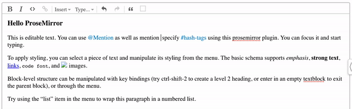

# ProseMirror Mentions

A [ProseMirror](https://prosemirror.net/) plugin that enables @mentions and #hashtags in a prosemirror view.



Demo: [https://star-drug.glitch.me/](https://star-drug.glitch.me/)

Alternative: [https://github.com/quartzy/prosemirror-suggestions](https://github.com/quartzy/prosemirror-suggestions)

## What's different then?

[prosemirror-suggestions](https://github.com/quartzy/prosemirror-suggestions) is a lighter alternative that comes with the bare minimum. It is upto you to implement the dropdown & related logic.

[prosemirror-mentions](https://github.com/joelewis/prosemirror-mentions) is a fully packed plugin. It comes with all batteries included: default dropdown UI, behavior handling, support for async fetching of suggestions, etc. [Configure options to suit your needs](#complete-list-of-options).

## Installation

```bash
npm install prosemirror-mentions
```

## Usage

```js
import {addMentionNodes, addTagNodes, getMentionsPlugin} from 'prosemirror-mentions'

...
...

var schema = new Schema({
    nodes: addTagNodes(addMentionNodes(schema.spec.nodes)),
    marks: schema.spec.marks
});

...
...


/**
 * IMPORTANT: outer div's "suggestion-item-list" class is mandatory. The plugin uses this class for querying.
 * IMPORTANT: inner div's "suggestion-item" class is mandatory too for the same reasons
 */
var getMentionSuggestionsHTML = items => '<div class="suggestion-item-list">'+
  items.map(i => '<div class="suggestion-item">'+i.name+'</div>').join('')+
'</div>';

/**
 * IMPORTANT: outer div's "suggestion-item-list" class is mandatory. The plugin uses this class for querying.
 * IMPORTANT: inner div's "suggestion-item" class is mandatory too for the same reasons
 */
var getTagSuggestionsHTML = items => '<div class="suggestion-item-list">'+
  items.map(i => '<div class="suggestion-item">'+i.tag+'</div>').join('')+
'</div>';

var plugins = [/* A list of other plugins */]

var mentionPlugin = getMentionsPlugin({
    getSuggestions: (type, text, done) => {
      setTimeout(() => {
        if (type === 'mention') {
            // pass dummy mention suggestions
            done([{name: 'John Doe', id: '101', email: 'joe@gmail.com'}, {name: 'Joe Lewis', id: '102', email: 'lewis@gmail.com'}])
        } else {
            // pass dummy tag suggestions
            done([{tag: 'WikiLeaks'}, {tag: 'NetNeutrality'}])
        }
      }, 0);
    },
    getSuggestionsHTML: (items, type) =>  {
      if (type === 'mention') {
        return getMentionSuggestionsHTML(items)
      } else if (type === 'tag') {
        return getTagSuggestionsHTML(items)
      }
    }
});

plugins.unshift(mentionPlugin); // push it before keymap plugin to override keydown handlers
...
...
window.view = new EditorView(document.querySelector("#my-editor-div"), {
  state: EditorState.create({
    schema: schema,
    plugins: plugins
  })
});
```

Refer [example application](https://github.com/joelewis/prosemirror-mentions/tree/master/example) for clarifications.

## Complete List of Options

```js
// default options
var defaultOpts = {
  // char for triggering @mention
  mentionTrigger: "@",

  // char for triggering #tag
  hashtagTrigger: "#",

  // if true: allows you to type @FirstName LastName with a space in between.
  allowSpace: true,

  /**
   * callback to fetch suggestions and return a list of suggestions
   * @param {String} type - 'mention' or 'tag'
   * @param {String} text - query text. For e.g @Joh -> text = 'Joh'
   * @param {Function} done - callback to execute after fetching suggestions (ideally from ajax requests)
   */
  getSuggestions: (type, text, done) => {
    done([]);
  },

  /**
   * callback to construct and return a HTML string for a set of suggestions
   * @param {Array} items - a list of suggestions returned from getSuggestions()
   * @param {String} type - 'mention' or 'tag'
   */
  getSuggestionsHTML: (items, type) =>
    '<div class="suggestion-item-list">' +
    items
      .map(i =>
        '<div class="suggestion-item">' + type === "mention"
          ? i.name
          : i.tag + "</div>"
      )
      .join("") +
    "</div>",

  // css class to add when a .suggestion-item element is active / selected.
  activeClass: "suggestion-item-active",

  // css class to add to "@Mentioned Text" in editor. Can be used to style, the current active @mention content.
  suggestionTextClass: "prosemirror-suggestion",

  // Max number of suggestions to show in dropdown UI.
  // The response from getSuggestions() will be truncated based on this value.
  maxNoOfSuggestions: 10,

  // debounce timeout for getSuggestions() call when user types continuously
  delay: 500
};
```

## Development

```bash
npm run build
npm run watch
```

## Authors

- [Joe Lewis](https://github.com/joelewis)

## Pending Tasks

`grep` the repository for "TODO:"

## ISSUES & FEEDBACK

Use Github Issues to file requests and bugs.

## License

MIT License
